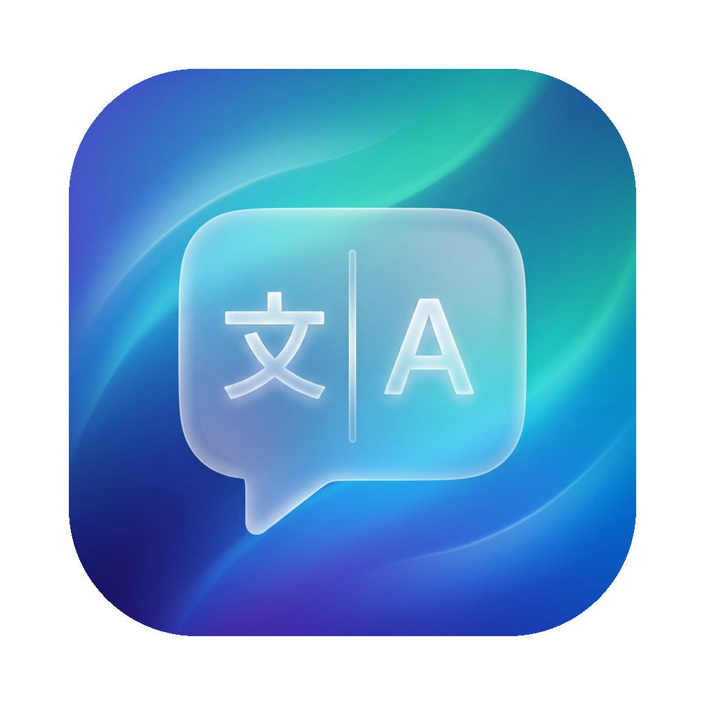
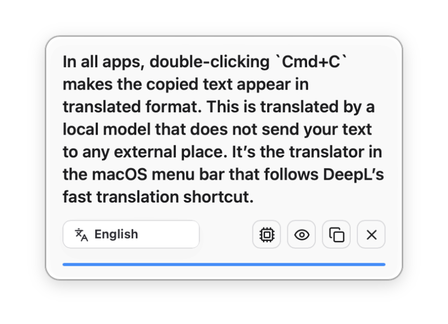
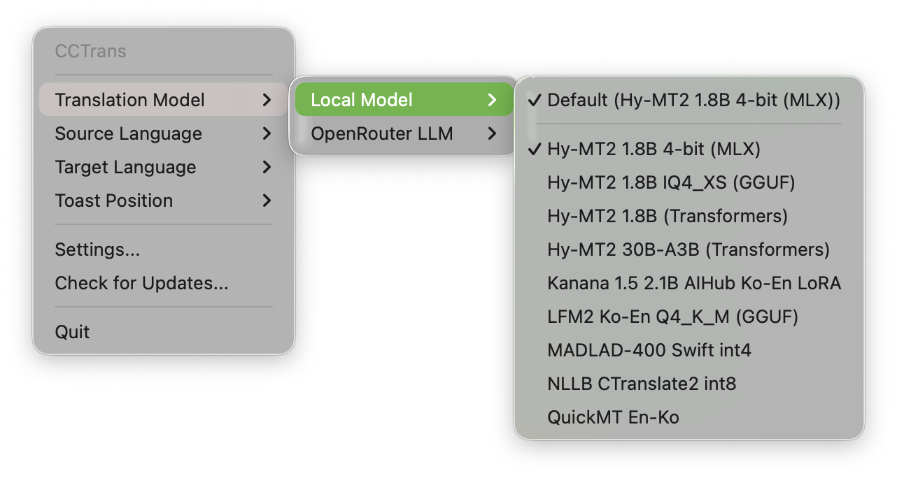

<p align="center">
  
  &nbsp;&nbsp;&nbsp;
  
</p>

# CCTrans

Press `Cmd+C` twice in any app — the copied text pops up as a translation toast, translated by a local model that never sends your text anywhere. A macOS menu-bar translator in the spirit of DeepL's quick-translate shortcut.

- **Run it all locally if you want** — fast, accurate AI translation on your own machine, from a local model that takes just ~1.3 GB of memory (970 MB on disk).
- **Or run it all on the smartest LLMs** — CCTrans captures your screen along with the copied text, so the model sees the surrounding context and translates what you actually mean.

```sh
brew install --cask kargnas/tap/cctrans
```

…or [download the DMG →](https://github.com/kargnas/cctrans/releases/latest) · macOS 15+ · auto-updates itself

## What it does

| You do | CCTrans does |
|---|---|
| `Cmd+C` twice on any text | Translates the clipboard and shows a toast where you parked it on screen |
| `Shift+Cmd+2` | Captures the screen and translates the visible text through a vision model |
| Click `⌘C` in the menu bar | Model picker, source/target language, toast position, request logs, settings |

<p align="center">
  
  <br>
  
</p>

The default model is **Hy-MT2 1.8B 4-bit running locally on MLX** — no API key, no network, nothing leaves the Mac:

```console
$ dist/CCTrans.app/Contents/MacOS/CCTrans --translate-text-once \
    "The deployment failed because the signing certificate expired last night."
지난 밤에 서명 인증서가 만료되었기 때문에 배포가 실패했습니다.
```

That run took 2.5 s warm on Apple Silicon, fully offline.

Pick an **OpenRouter LLM** instead and CCTrans silently attaches a downscaled screenshot of your current screen as context (only when Screen Recording is already granted), so short ambiguous snippets get translated the way the page around them means it.

## Local Models, Measured

Every built-in model was benchmarked on an Apple Silicon Mac before earning its menu slot — full data and sample outputs in [docs/local-translation-benchmark-2026.md](docs/local-translation-benchmark-2026.md):

| Model | Status | Peak memory | Per request | Note |
|---|---|---:|---:|---|
| **Hy-MT2 1.8B 4-bit (MLX)** | ✅ default | 1.5 GB | 0.08–0.17 s | Best quality — keeps terminology right where others slip |
| Hy-MT2 1.8B (Transformers) | ✅ bundled | — | — | Legacy Python backend; slower than MLX on the same Mac |
| Hy-MT2 30B-A3B (Transformers) | ✅ bundled | — | — | Highest quality, needs serious RAM |
| QuickMT En-Ko | ✅ bundled | 1.2 GB | 0.02–0.03 s | Fastest of all, but fails isolated short words |
| Hy-MT2 1.8B IQ4_XS (GGUF) | 🔌 planned | 1.4 GB | 0.08–0.61 s | Benchmarked well; llama.cpp adapter not bundled yet |
| LFM2 Ko-En Q4_K_M (GGUF) | 🔌 planned | 1.6 GB | 0.07–0.20 s | Fast Ko↔En; license still under review |
| NLLB CTranslate2 int8 | 🔌 planned | 1.6 GB | 0.06–0.21 s | Widest language coverage, stiffer Korean output |
| Kanana 1.5 2.1B AIHub Ko-En LoRA | ⚠️ off by default | 0.8 GB | 0.4–1.7 s | CC-BY-NC license and fragile Python deps |
| MADLAD-400 Swift int4 | 🔌 planned | — | — | Swift runtime builds, MLX metallib loading still fails |

Numbers are peak RSS and warm per-request latency from the standalone benchmark runs. First launch opens **Local Model Setup** with this comparison built in, and custom models drop into `~/.config/cctrans/local-models.json` ([protocol](docs/local-runtimes.md)).

## Stack at a Glance

| Layer | Tech |
|---|---|
| Menu-bar shell | Swift 6.2 + AppKit (SwiftPM, `LSUIElement`) |
| Settings / toast surfaces | Tauri 2 + Rust + Svelte |
| Local inference | Hy-MT2 on MLX, launched through `uv` |
| Cloud translation & vision | OpenRouter (`~google/gemini-flash-latest` default for screenshots) |
| Auto-update | Sparkle 2, appcast on GitHub Releases |
| Release pipeline | GitHub Actions: build → Developer ID sign → notarize → DMG |

## Run Locally

```sh
git clone https://github.com/kargnas/cctrans && cd cctrans
npm install
./scripts/run-dev.zsh
```

`run-dev.zsh` builds the Swift shell and the Tauri helper, signs `dist/CCTrans.app` with a stable local identity (so macOS permissions stick across rebuilds), and launches it. Local models additionally need [`uv`](https://docs.astral.sh/uv/); OpenRouter features need `cp .env.example .env.local` with an `OPENROUTER_API_KEY`.

To install on this Mac: `./scripts/install-app.zsh --open`. For another Mac, see [docs/other-mac-setup.md](docs/other-mac-setup.md).

## Permissions

Global shortcuts need macOS privacy approval once:

| Permission | Needed for |
|---|---|
| Input Monitoring *or* Accessibility | Detecting `Cmd+C` twice in other apps |
| Screen Recording | `Shift+Cmd+2` screenshot translation and LLM screen context |

**Settings → Permission Helper** opens the right privacy pane and shows a draggable `CCTrans.app` icon to drop into the list. Quit and relaunch CCTrans after granting — macOS applies trust on the next launch.

## Releases & Auto-Update

Every code push to `main` releases itself: a 10-minute cooldown collects follow-up commits, the patch version bumps from the latest tag, and GitHub Actions ships a signed, notarized `CCTrans-vX.Y.Z.dmg` plus `appcast.xml`. The same run then bumps the Homebrew cask in [kargnas/homebrew-tap](https://github.com/kargnas/homebrew-tap). Installed apps check the appcast daily and update in place via Sparkle; **Check for Updates...** in the menu bar checks immediately. Commit with `[skip release]` to opt out, or run the `Auto Release` workflow manually for a minor/major bump.

## More

- [docs/local-runtimes.md](docs/local-runtimes.md) — local backend protocol, custom model JSON, benchmark results
- [docs/other-mac-setup.md](docs/other-mac-setup.md) — installing on a second Mac
- [AGENTS.md](AGENTS.md) — contract for coding agents working on this repo
- **Request Logs...** in the menu bar — last 200 requests with token usage, model, attached image size, and duplicate suspects
